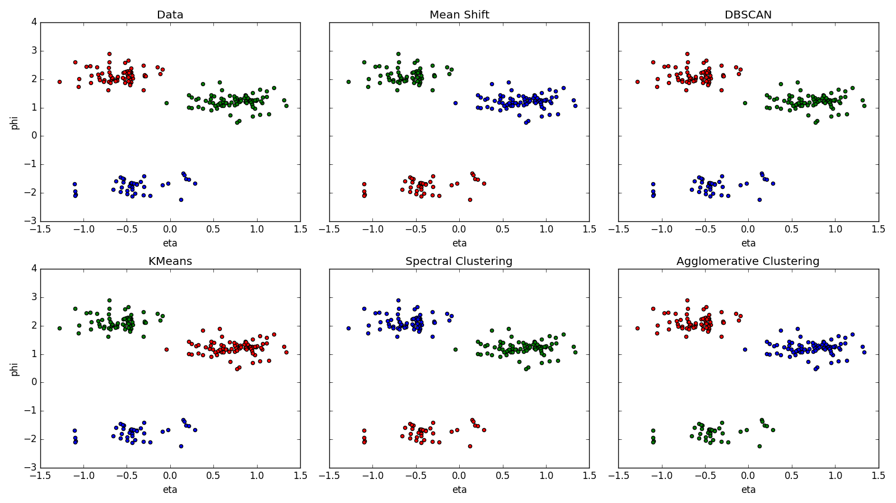

# Jet clustering with [scikit-learn](http://scikit-learn.org) on lxplus.cern.ch

Instructions to setup the working area on **lxplus**:

~~~~~~~~~~~~~~~~~~~~~~~~~~~~~~~~~~~~~~~~~~~~~~~~~~~~~~~~~~~~~~~~~~~~~~~~~~~~~~~~
export SCRAM_ARCH=slc6_amd64_gcc530
cmsrel CMSSW_8_0_26_patch1
cd CMSSW_8_0_26_patch1/src
cmsenv
git clone git@github.com:amadio/jet-clustering.git
cd jet-clustering
jet-constituents 10
for csv in data/\*.csv; do jet-cluster ${csv}; done
~~~~~~~~~~~~~~~~~~~~~~~~~~~~~~~~~~~~~~~~~~~~~~~~~~~~~~~~~~~~~~~~~~~~~~~~~~~~~~~~

The code picks the first **n** events from the dataset 

- BulkGravToZZToZhadZhad_narrow_M-1800_13TeV-madgraph

For each event, a csv data file is created with the list of jet constituents. 

## Data file format

Each data file contains the list of jet constituents with kinematic information
necessary to seed the clusterization algorithm. The name of the data files
follow the syntax **event-%04d.csv**. The momentum coordinates are normalized.

## Plotting data and clusters

The `jet-cluster` script takes a data file as argument and generates a PNG file
with the plots of real and fitted clusters.

### Example

